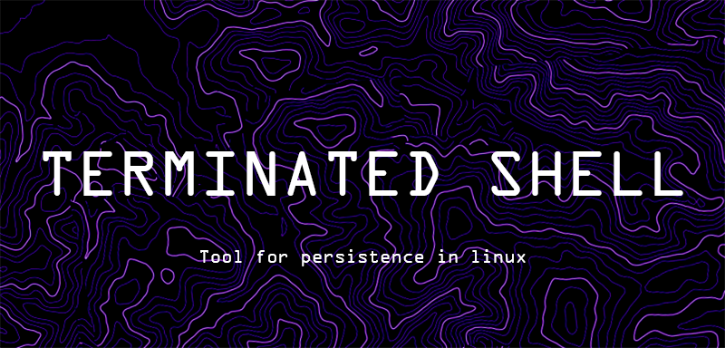

<h1 align="center">Terminated Shell</h1>
<div align="center" id="top"> 
  

  &#xa0;

  <!-- <a href="https://terminatedshell.netlify.app">Demo</a> -->
</div>

<p align="center">
  
   
  
</p>

<hr> 

<p align="center">
  <a href="#dart-about">About</a> &#xa0; | &#xa0; 
  <a href="#sparkles-features">Features</a> &#xa0; | &#xa0;
  <a href="#rocket-technologies">Technologies</a> &#xa0; | &#xa0;
  <a href="#white_check_mark-requirements">Requirements</a> &#xa0; | &#xa0;
  <a href="#checkered_flag-starting">Starting</a> &#xa0; | &#xa0;
  <a href="#memo-license">License</a> &#xa0; | &#xa0;
  <a href="https://github.com/anonimidin" target="_blank">Author</a>
</p>

<h4 align="center"> 
	🚧  Beta verison 0.1  🚧
</h4> 

## :dart: About ##

Welcome to the Terminated Shell script – a tool crafted for Linux persistence, user management, and system configuration. Dive into the Linux underworld and unleash your control!

## :sparkles: Features ##

- **User Management**
  - View, add, or delete users.
  - Elevate your control with superuser privileges.

- **Shell Configuration Persistence**
  - Personalize your shell configuration (~/.bashrc or ~/.zshrc) effortlessly.

- **Scheduler Persistence**
  - Schedule tasks using at or cron.
  - Inject your payload into the Linux timeline.

- **Hooks Playground**
  - Interact with Git hooks and config.
  - Add custom payloads to pre-commit hooks and Git config files.

- **System Daemon Unleashed**
  - Master the art of systemd units for both system and user levels.
  - Inject your custom payloads into the heart of Linux.


## :white_check_mark: Requirements ##

Before starting :checkered_flag:, ensure you have the necessary packages installed:

```bash
sudo apt-get update -y && sudo apt-get install at socat systemd -y
```
## :checkered_flag: Starting ##

Choose your preferred one-liner to download and run the script:

- **Using curl**

``` bash
curl -LO https://github.com/anonimidin/terminatedshell/raw/main/terminatedshell.sh && chmod +x terminatedshell.sh && ./terminatedshell.sh
```

- **Using wget**

``` bash
wget https://github.com/anonimidin/terminatedshell/raw/main/terminatedshell.sh -O terminatedshell.sh && chmod +x terminatedshell.sh && ./terminatedshell.sh
```

- **Using git**
``` bash
git clone https://github.com/anonimidin/terminatedshell.git && cd terminatedshell && chmod +x terminatedshell.sh && ./terminatedshell.sh 
```

## :memo: License ##

This project is under license from Apache License 2.0. For more details, see the [LICENSE](LICENSE.md) file.

## Disclaimer ##

Use this script responsibly and for educational purposes only. The script author and contributors are not responsible for any misuse or damage caused by its use.

Made by <a href="https://github.com/anonimidin" target="_blank">Anonimidin </a> for red teamers. Keep persisting in the Linux realm, and may your shells be ever terminated! 💀🐧

<a href="#top">Back to top</a>
